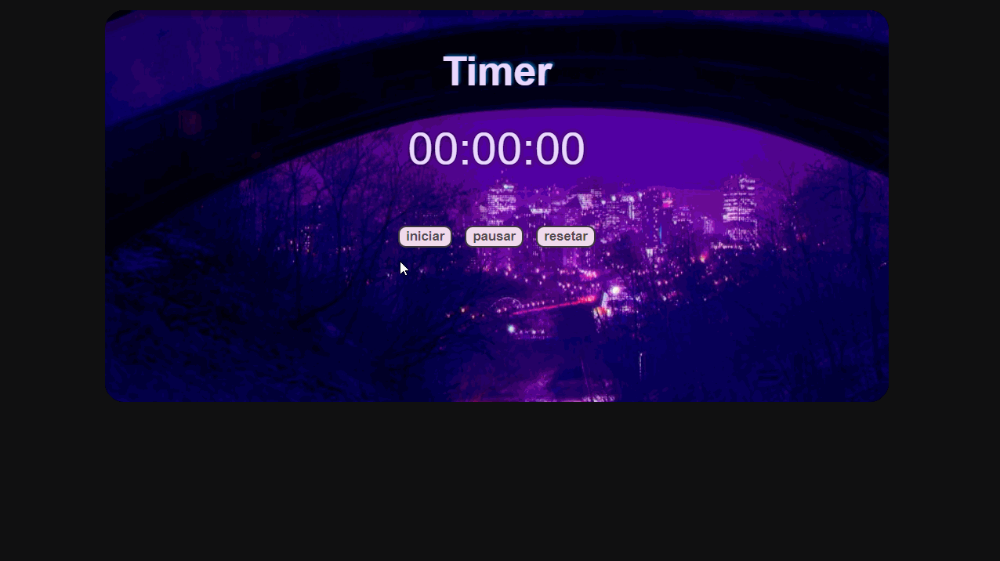

  # Timer ⏱

### Exercício simples para praticar :muscle:

>Este é um exercício que desenvolvi no curso do [Luiz Otávio Miranda](https://www.udemy.com/course/curso-de-javascript-moderno-do-basico-ao-avancado/).

>Fiz algumas alterações no background do timer, estilizei os botões e adicionei elementos do _ES6_ - **_arrow functions_**.
#
 ### Ficou assim   👇
> 
#

###  Tecnologias usadas 📌
>- JavaScript (Vanilla JS)
>- HTML
>- CSS
